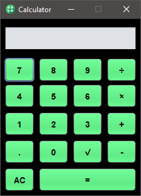

# Calculator
I did this project for a school homework. 
The objective is study GUI and OOP in java. 
Ide: NetBeans 16

# Screenshot

# Updates
- Simplify the code
- Update interface
- Update the features
